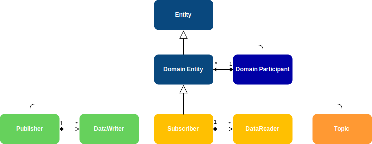

## 3.1.1. エンティティ
エンティティは、全てのDDSエンティティの抽象ベースクラスであり、QoSポリシー、リスナー、ステータスをサポートするオブジェクトを意味する。

### 3.1.1.1 エンティティの型
- **DomainParticipant**： このエンティティは、サービスのエントリ・ポイントであり、パブリッシャ、サブスクライバ、およびトピックのファクトリとして機能する。 
- **Publisher**： 任意の数の DataWriters を作成できるファクトリとして動作する。 
- **Subscriber** : 任意の数の DataWriters を作成できるファクトリとして動作する。
- **topic** : このエンティティは、パブリケーション・エンティティとサブスクリプション・エンティティの間に位置し、チャネルとして機能する。
- **DataWriter** : データ配布を担当するオブジェクト。
- **DataReader** : 受信したデータにアクセスするためのオブジェクト。

以下の図は、全てのDDSエンティティ間の階層を示している:



#### 3.1.1.2 共通するエンティティの特徴
全てのエンティティ型には、エンティティの概念に共通するいくつかの特徴がある。以下に示す。

##### 3.1.1.2.1 エンティティ識別子
各エンティティは一意のIDで識別され、このIDはDDSエンティティおよび対応するRTPSエンティティが存在する場合はそのエンティティ間で共有される。 このIDはEntity基底クラスで宣言されたインスタンスハンドルオブジェクトに格納され、ゲッター関数`get_instance_handle()`を使用してアクセスできる。

##### 3.1.1.2.2 QoSポリシー
各エンティティの動作は、設定ポリシーのセットで設定できる。 各エンティティタイプには、対応するQoS（Quality of Service）クラスがあり、当該エンティティタイプに影響するすべてのポリシーがグループ化されている。 ユーザーは、これらのQoSクラスのインスタンスを作成し、含まれているポリシーを必要に応じて変更し、エンティティの作成時または後で、すべてのエンティティが公開している`set_qos()`関数（`DomainParticipant::set_qos()`、`Publisher::set_qos()`、`Subscriber::set_qos()`、`Topic::set_qos()`、`DataWriter::set_qos()`、`DataReader::set_qos()`）を使用して、エンティティを設定するために使用できます。 QoSクラスとその中に含まれるポリシーについては、各エンティティ・タイプのドキュメントで説明されています。

##### 3.1.1.2.3 リスナー
リスナーは、エンティティがイベントに応答して呼び出す関数を持つオブジェクトである。 したがって、リスナーは、エンティティの Status の変更をアプリケーションに通知するための非同期通知システムとして機能する。 すべてのエンティティ・タイプは、Status の変更をアプリケーションに通知するためにエンティティがトリガーするコールバック関数を含む抽象リスナー・インターフェースを定義している。 ユーザーは、これらのインタフェースを継承した独自のリスナーを実装し、アプリケーションで必要なコールバックを実装することができる。 その後、これらのリスナーを各エンティティの作成時または後で、各エンティティが公開する `set_listener()` 関数で各エンティティにリンクできる（`DomainParticipant::set_listener()`, `Publisher::set_listener()`, `Subscriber::set_listener()`, `Topic::set_listener()`, `DataWriter::set_listener()`, `DataReader::set_listener()`）。 各エンティティ・タイプが持つリスナー・インターフェースとそのコールバックは、各エンティティ・タイプのドキュメントで説明されている。 イベントが発生すると、NULL でなく、StatusMask で対応するコールバックが有効になっているリスナーを持つ最下位レベルのエンティティによって処理される。 
次の図に示すように、上位レベルのリスナーは下位レベルのリスナーを継承する：


<details><summary>メモ</summary>
on_data_on_readers()コールバックは、on_data_available()の前にメッセージを傍受する。 これは、DomainParticipantListenerが有効になっている場合、ユーザーはデフォルトでリスナーがStatusMask::all()を使用することを考慮する必要があることを意味する。 コールバック・エンティティの階層が保持されるので、on_data_on_readers()がこの場合に呼び出されることになる。 アプリケーションが代わりにon_data_available()を使いたい場合は、StatusMaskの対応するビットを無効にする必要がある。
</details>
<details><summary>重要</summary>
エンティティの作成時に``` StatusMask::none() ```を使用すると、DDS 標準コールバックが無効になる：
- ```on_sample_rejected()```
- ```on_liveliness_changed()```
- ```on_requested_deadline_missed()```
- ```on_requested_incompatible_qos()```
- ```on_data_available()```
- ```on_subscription_matched()```
- ```on_sample_lost()```
- ```on_offered_incompatible_qos()```
- ```on_offered_deadline_missed()```
- ```on_liveliness_lost()```
- ```on_publication_matched()```
- ```on_inconsistent_topic()```
- ```on_data_on_readers()```

FastDDS固有のコールバックは常に有効：
- ```on_participant_discovery()```
- ```onParticipantAuthentication()```
- ```on_data_reader_discovery()```
- ```on_data_writer_discovery()```
- ```on_unacknowledged_sample_removed()```

</details>

<details><summary>注意</summary>
実装されたリスナーごとに1つのスレッドのみが作成されるため、 リスナー関数をシンプルに保ち、そのような情報の処理を適切なクラスに任せること。


Listener メンバ関数のスコープ内で Entity を生成または削除しないこと。 その代わりに、Listener クラスを情報チャネルとして使用し、上位の Entity クラスでそのような振る舞いをカプセル化することを推奨する。
</details>

##### 3.1.1.2.4 ステータス
各エンティティは、そのエンティティの通信ステータスを表すステータスオブジェクトのセットに関連付けられている。 これらのステータス値の変更は、アプリケーションに非同期に通知するための適切なリスナーコールバックの呼び出しをトリガーする。 すべてのステータスオブジェクトのリストとその内容の説明は Status を参照すること。 また、どのステータスがどのエンティティタイプに適用されるかを見つけることもできる。

##### 3.1.1.2.5 StatusCondition
すべてのエンティティは StatusCondition を所有しており、有効なステータスが変更されるたびに通知される。StatusCondition は、エンティティと待機セット間のリンクを提供する。詳細については、「条件と待機セット」セクションを参照すること。

##### 3.1.1.2.6 エンティティの有効化
すべてのエンティティは、有効または無効のいずれかで作成できる。 デフォルトでは、ファクトリはエンティティを有効化して作成するように構成されているが、有効化されたファクトリでEntityFactoryQosPolicyを使用して変更できる。 無効化されたファクトリは、QoS に関係なく無効化されたエンティティを作成する。 無効にされたエンティティの操作は次のものに制限される。 
- エンティティの QoS ポリシーの設定/取得。
- エンティティのリスナーの設定/取得。
- サブエンティティの作成/削除。
- エンティティのステータスの取得（変更されない場合も）。
- ルックアップ操作。

この状態で呼び出された他の関数は ```NOT_ENABLED``` を返す。