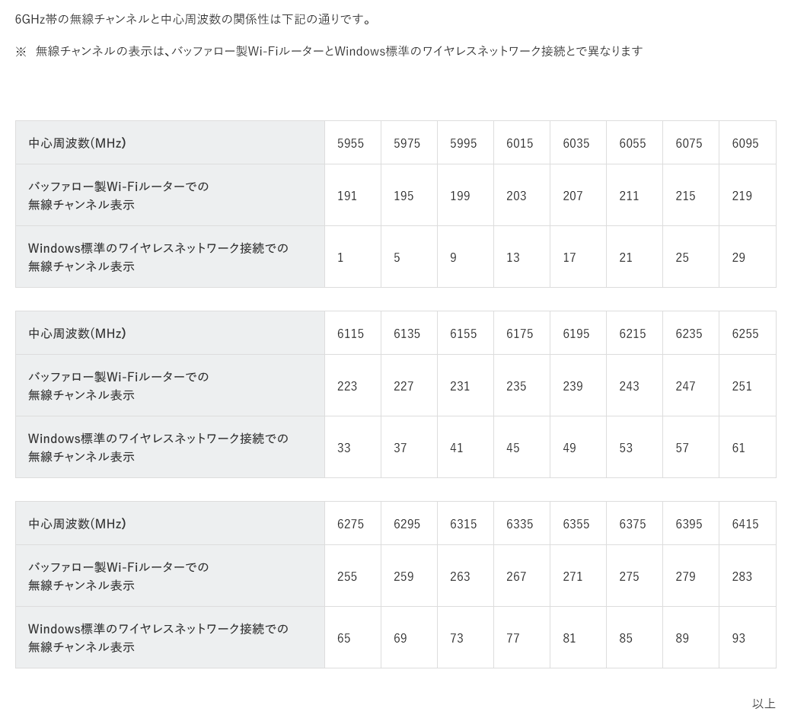

某所の某チャンネルにて、
```
6GHz帯を使う全ての機器に関して
手動でのチャンネル選択が可能か
使用できるチャンネル・帯域幅
```
とwifiについて聞かれたため、
```

手動でのチャンネル変更が可能か
可能です

使用できるチャンネル、帯域幅
現時点で接続確認が取れているチャンネルは、
`ch195 / ch211 / ch227 / ch243` です

よろしくお願いします。
```

と返答したところ、

```
某所の件で、下記メッセージについて確認させていただきたくご連絡しました。

ご提示の ch195 / ch211 / ch227 / ch243 についてなのですが、6GHz Wi-Fi のチャンネル番号として見ると、いずれも約6.9〜7.1GHz（上側6GHz）にあたり、日本で開放されている 5925〜6425MHz の範囲外のように見受けられます。

国内の技適機器で運用する場合は、6GHz帯は ch1〜ch93、PSC であれば ch5 / 21 / 37 / 53 / 69 / 85 から選ぶ形になると認識しているのですが、上記チャンネルは別のリージョン設定や特別な運用を前提とされているものでしょうか。
```
と言われてしまった😇  
100%ワイが悪いね。

敗因として、[こいつ](https://www.buffalo.jp/support/faq/detail/124158987.html)がいらんことをしたという言い訳をします。~AIに返答文作らせて記載chを見るの確認し忘れてた~

  
↑以上じゃねえよ

はい。buffalo製ルーターを運用ときは、ちゃんとch見ようね(自戒)って言うお話でした。
ちゃんと表記してくれるルーターにしてえよ、こんなん分からんって...
カタログスペックだけ見てちゃアカンですよ(自戒)(遠い目)

~もう二度とbuffalo使いたうないですね、宅内環境は全部Ubiquitiで固めてやろうと思います~