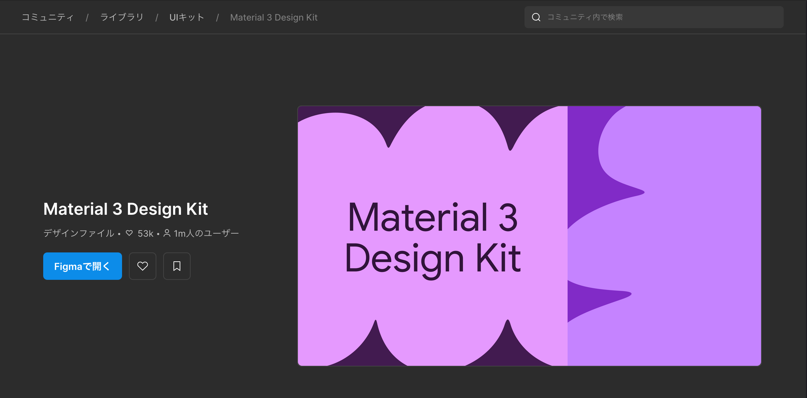

# Figma UI作成ガイド

> Material Design 3を使ったAndroidアプリUIデザインの手順まとめ。
> Jetpack Composeでの実装を想定。

---

やーなんか、前からandroidのUIをFigmaで作れれたら楽なのにね〜〜〜って言ってたので色々試してました  
どうやら、android13~15の時期あたりにエクスポートプラグインが廃止されたり、AIが無双しつつあるときにMCPサーバーが出てきたりしたのでソレに合わせました。~~プラグインで楽してUI作ろうと思ってmac買った後にプラグイン廃止になったの知ったとか言えない~~

## 目次

1. [基本概念](#基本概念)
2. [Material Design 3キットの導入](#material-design-3キットの導入)
3. [Frameの作成](#frameの作成)
4. [コンポーネントの配置](#コンポーネントの配置)
5. [テキストの編集](#テキストの編集)
6. [よくあるトラブル](#よくあるトラブル)
7. [Dev Mode（コード参照）](#dev-modeコード参照)
8. [Jetpack Composeへの変換](#jetpack-composeへの変換)

---

## 基本概念

まず3つの概念だけ押さえておけばいいらしい。

| 概念 | 説明 |
|------|------|
| **Frame** | 画面の枠。コンポーネントはこの中に配置する |
| **Component** | ボタン・カードなど再利用可能なUIパーツ |
| **Layer** | 左サイドバーに表示される要素の階層構造 |

> **重要**: FigmaのデザインはあくまでUIの設計図。ボタンを押しても動作しない。
> 動きをつけたい場合は後述のPrototypeモードを使う。

---

## Material Design 3キットの導入

### 追加インストールは不要(?)

FigmaにはMaterial Design 3（以下MD3）が最初から入っている。   
CommunityからのDuplicateやライブラリ追加をしなくてもいい。  
↑これホンマかわからん。もしなかったら、コミュニティで`Material 3 design`とググってインポートしてライブラリ追加



### コンポーネントの呼び出し方

1. 左サイドバーの **Assets**（格子アイコン）をクリック、または `Shift + I`
2. 検索欄にコンポーネント名を入力（例：`Button`、`Card`、`Text field`）
3. `Material Design 3` セクション配下に候補が表示される
4. キャンバスへドラッグ＆ドロップで配置


---

## Frameの作成

コンポーネントを置く前に、必ずFrameを作る。
Frameなしで置くと背景が透明になってレイアウトの基準もなくなるので、最初の手順として忘れずに。

### 手順

1. `F` キーを押す（Frameモードに切り替わる）
2. キャンバス上をドラッグして枠を描く
3. 描いたFrameをクリックして選択する
4. 右サイドバーの W・H に画面サイズを入力する


変なライブラリ入れてたらこんなのが出るかもネ。

### Google Pixelの推奨サイズ

| 機種 | W（幅） | H（高さ） |
|------|---------|---------|
| Pixel 9 / 8 / 7系 | 412 | 917 |
| Pixel 9 Pro XL | 412 | 952 |

特定機種にこだわりがなければ **412 × 917** を使いまわせる。

### Frameに背景色をつける

1. Frameを選択
2. 右サイドバーの **Fill** → `+` ボタン
3. `FFFFFF`（白）を入力

↑このまま放置したら、テキストの文字も白になるので注意

---

## コンポーネントの配置

### 主要コンポーネントと用途

| コンポーネント名 | 用途 |
|------|------|
| `Top App Bar` | 画面上部のヘッダーバー |
| `Navigation Bar` | 画面下部のタブナビゲーション |
| `Card`（Horizontal card） | 曲・アイテムの一覧表示 |
| `List Item` | テキストベースのリスト行 |
| `Button` | 各種アクションボタン |
| `Text field` | テキスト入力欄 |

やーさあ、androidのUIに慣れてないとこれ使うんかなり難しいと思うんすよ  
っぱAndroidの開発者ならメイン機で1年くらい使って、Material Designとjetpack composeに慣れるべき(暴論)


じゃけん心理眼でこれが見えるようになるまで鍛えましょうね


### プロパティの変更

コンポーネントを選択すると右サイドバーに **Properties** が表示される。
スタイル（Filled / Outlined など）やアイコンの有無をここでクリックするだけで変えられる。
コードを触らずに見た目を調整できるのは、Figmaを使う理由のひとつ。


### Clip contentの設定

コンポーネントがFrameからはみ出す場合は以下を設定する。

- Frameを選択 → 右サイドバーで `Clip content` をオン

---

## テキストの編集

### UIに静的なテキストを置く場合

1. `T` キーを押す（テキストモードに切り替わる）
2. キャンバス上をクリックしてテキストを入力
3. 入力完了後 `Escape` キーで編集モードを抜ける

### コンポーネント内のテキスト（Header・Subheadなど）を変更する場合

コンポーネントのテキストは1回クリックしただけでは編集できないことが多い。
ダブルクリックを繰り返して、内部のレイヤーに潜っていく。

1. 1回クリック → コンポーネント全体を選択
2. ダブルクリック → 内部グループに入る
3. さらにダブルクリック → テキストレイヤーに到達
4. テキストが選択されたら編集可能になる

左サイドバーのレイヤーパネルで今どの階層にいるか確認しながら操作すると迷いにくい。

> **注意**: 右クリック → `Detach instance` でもテキスト編集はできるが、
> コンポーネントとの同期が切れるため基本的には使わない。

### テキストのスタイル変更

| 項目 | 操作 |
|------|------|
| フォントサイズ | 右サイドバーで数値を直接入力 |
| 太字・斜体 | B / I ボタン |
| 色 | Fill の色をクリック |
| 行揃え | 左・中央・右のアイコン |

---

## よくあるトラブル

### コンポーネントに変な記号が表示される（⌘C など）

プロパティに不要な値が入っている状態。

**対処**: 該当コンポーネントを選択 → 右サイドバーのPropertiesで
`Trailing` や `Shortcut` などのプロパティを `None` に変更する。

### コンポーネントがフレームからはみ出す

**対処**: Frameを選択 → 右サイドバーで `Clip content` をオン。
またはコンポーネントの幅をFrame内に収まるよう調整する。

### リストが下部ナビゲーションバーに被る

**対処**: リスト全体の高さを調整するか、下部にPaddingを設ける。

### ボタンを押しても何も起きない

Figmaはデザインの設計図なので、デフォルトでは操作に反応しない。
画面遷移させたい場合は Prototype モードを使う。

1. 右上のタブを `Design` → `Prototype` に切り替える
2. ボタンを選択 → `+` が出る → 遷移先のFrameに繋げる
3. 右上のプレビューボタンで動作確認できる

---

## Dev Mode（コード参照）

### Dev Modeとは

選択したコンポーネントの色・サイズ・余白などの値を確認できるモード。
Figmaの下側トグルで切り替える。

これが普通(?)のモード

こっちがDev Modeね

MD3コンポーネントに限り、Jetpack Composeのコードスニペットも表示される。

> Dev Modeが出力するのは React + Tailwind CSS のコード。
> Jetpack Composeへは手動で変換する必要がある。


コードを吐き出させたかったら、吐き出させたい画面上をセクション？とやらで囲う必要があるらしい。[こっち](https://note.com/fjkn/n/n7ce8729696a5)見たらなんか書いてある

### Dev Modeで参照できる値の例

| Figmaの値 | Composeでの使い方 |
|------|------|
| `#F3EDF7` | `Color(0xFFF3EDF7)` |
| `padding: 16px` | `Modifier.padding(16.dp)` |
| `height: 80px` | `Modifier.height(80.dp)` |
| `border-radius: 12px` | `RoundedCornerShape(12.dp)` |

### FigmaとComposeのコンポーネント対応表

| Figma上 | Jetpack Compose |
|------|------|
| Top App Bar（Center-aligned） | `CenterAlignedTopAppBar()` |
| Navigation Bar | `NavigationBar()` |
| Toolbar（Bottom） | `BottomAppBar()` |
| Horizontal card（Outlined） | `OutlinedCard()` |
| List Item | `ListItem()` |
| Filled Button | `Button()` |
| Outlined Text Field | `OutlinedTextField()` |

---

## Jetpack Composeへの変換

### 実際のワークフロー
```
Figmaでデザイン確定
    ↓
Dev Modeで各パーツのコード参照（色・サイズ・余白を確認）
    ↓
参照しながらCompose実装を手書き
```

って言ってますけど、なんかMCP連携されてる各AIにプロンプト投げたら勝手に見てくれてコード吐いてくれるらしい


っぱclaudeすげえわ、ぽみゃーらも契約すると良いですよ。月3000でロボットが動くなら安いもんや(遠い目)

### Figmaから自動エクスポートはできないのか？

`Figma to Compose` 系のプラグインはあるが、出力コードの品質が低く手直しが多くなる。昔は存在していたが、非対応になったため今のandroid studioではプラグインすら入れれないし動作しないと思う。  
Dev Modeで値を確認しながら手書きするか、AIに丸投げする方が早い。

### なぜFigmaにMD3が入っているのか

FigmaのコンポーネントとJetpack Composeのコンポーネントは名前も構造もほぼ1対1で対応している。
デザイナーとエンジニアが同じ部品名で話せるようにするための設計で、
自動変換というより、共通言語としての役割が大きい。

---

ま〜〜〜〜〜〜〜アレですよ  

UIなんて、スマホなんて勝つために必要ないんですよ  
勝つためにどのリソースに力入れて、何を楽するか考えると良いですよ

## 参考リンク

- [Material Design 3 公式](https://m3.material.io/)
- [Material Design 3 Components](https://m3.material.io/components)
- [Jetpack Compose Material3](https://developer.android.com/jetpack/compose/designsystems/material3)